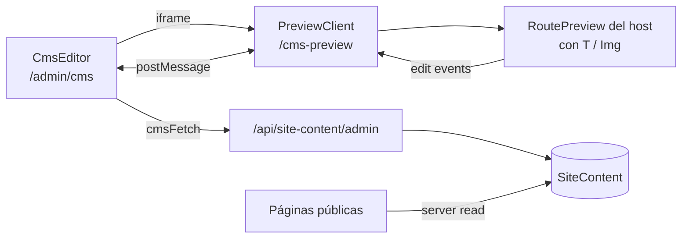

# Preview CMS Kit

Kit portable del **Preview CMS** extraído de Luriam: editor con iframe, edición inline de texto e imágenes, persistencia en Postgres y API de Next.js.

Copiá esta carpeta a otro proyecto Next.js 15 (App Router) y seguí los pasos de integración.

## Qué incluye

- **Editor** (`CmsEditor`): toolbar con rutas, idiomas, guardar/descartar y iframe de preview.
- **Preview** (`PreviewClient`): renderiza tus páginas reales dentro del iframe y sincroniza cambios por `postMessage`.
- **Componentes editables**: `<T path="..." />` (texto) y `` (imagen con upload).
- **API**: `GET/PUT /api/site-content/admin` + `POST /api/site-content/upload`.
- **Validación**: árbol JSON con límites de profundidad, arrays y strings.
- **Demo mínimo**: páginas de ejemplo con diccionarios `es`/`en`.

## Requisitos del proyecto host

- Next.js 15+ (App Router)
- React 19+
- Prisma + Postgres
- Tailwind CSS (estilos del editor y componentes editables)
- Sesión con cookies (better-auth, NextAuth, Clerk, etc.)

## Arquitectura



## Instalación rápida

### 1. Copiar archivos

Desde la raíz de tu proyecto Next.js:

```text
preview-cms-kit/src/          →  src/lib/preview-cms/   (o la ruta que prefieras)
preview-cms-kit/prisma/       →  integrar en tu schema.prisma
preview-cms-kit/src/app-templates/  →  src/app/
```

Recomendación: alias en `tsconfig.json`:

```json
{
  "compilerOptions": {
    "paths": {
      "@preview-cms/*": ["./src/lib/preview-cms/*"]
    }
  }
}
```

### 2. Base de datos

Agregá el modelo de [`prisma/site-content.schema.prisma`](prisma/site-content.schema.prisma) a tu `schema.prisma` y ejecutá la migración ([`prisma/migration.sql`](prisma/migration.sql)):

```bash
pnpm exec prisma migrate dev --name site_content
```

### 3. Variables de entorno

Copiá [`.env.example`](.env.example) a tu `.env`:

```env
DATABASE_URL=postgresql://...
UPLOADS_DIR=./uploads
CMS_UPLOAD_MAX_MB=5
```

Configurá Next para servir `/uploads` desde `UPLOADS_DIR` (rewrite o `public/`).

### 4. Configuración central

Copiá [`cms.config.example.ts`](cms.config.example.ts) a `src/config/cms.config.ts` y ajustá:

| Opción | Descripción |
|--------|-------------|
| `previewSource` | Identificador del protocolo `postMessage` (único por app) |
| `previewRoutes` | Rutas que el editor puede previsualizar |
| `locales` | Idiomas soportados (`es`, `en`, …) |
| `allowedTopLevelKeys` | Secciones JSON permitidas al guardar |
| `adminPath` / `previewPath` | URLs del editor e iframe |
| `auth.getSession` / `auth.canEdit` | Adaptador de autenticación |

### 5. Prisma del host

Reemplazá el stub en [`src/lib/prisma.ts`](src/lib/prisma.ts):

```ts
import { PrismaClient } from '@prisma/client';
export const prisma = new PrismaClient();
```

### 6. Rutas App Router

Los templates están en [`src/app-templates/`](src/app-templates/):

| Template | Destino en tu app |
|----------|-------------------|
| `admin/cms/page.tsx` | `app/admin/cms/page.tsx` |
| `admin/cms/layout.tsx` | `app/admin/cms/layout.tsx` |
| `cms-preview/page.tsx` | `app/cms-preview/page.tsx` |
| `cms-preview/layout.tsx` | `app/cms-preview/layout.tsx` |
| `api/site-content/admin/route.ts` | `app/api/site-content/admin/route.ts` |
| `api/site-content/admin/[locale]/route.ts` | `app/api/site-content/admin/[locale]/route.ts` |
| `api/site-content/upload/route.ts` | `app/api/site-content/upload/route.ts` |

Ajustá los imports según dónde copies el kit.

### 7. RoutePreview (obligatorio)

Reemplazá [`src/components/RoutePreview.example.tsx`](src/components/RoutePreview.example.tsx) con tu propio componente que renderice las mismas páginas que el sitio público:

```tsx
'use client';

import { useEdit } from '../lib/content-edit/EditProvider';
import HomePage from '@/app/(marketing)/page';
import AboutPage from '@/app/(marketing)/about/page';

export default function RoutePreview() {
  const { previewRoute } = useEdit();
  switch (previewRoute) {
    case '/about':
      return <AboutPage />;
    default:
      return <HomePage />;
  }
}
```

Actualizá el import en `PreviewClient.tsx` para apuntar a tu `RoutePreview`.

### 8. Marcar contenido editable

En tus componentes de marketing:

```tsx
import { T } from '@preview-cms/lib/content-edit/T';
import { Img } from '@preview-cms/lib/content-edit/Img';
import { PreviewAwareLink } from '@preview-cms/lib/content-edit/PreviewAwareLink';

export function Hero() {
  return (
    <section>
      <T path="hero.title" as="h1" />
      <T path="hero.subtitle" as="p" />
      
      <PreviewAwareLink href="/about">About</PreviewAwareLink>
    </section>
  );
}
```

Los `path` deben existir en tu diccionario i18n base. El CMS guarda solo **overrides** parciales.

### 9. Publicar en el sitio

En el layout raíz (Server Component):

```tsx
import { getSiteContentOverrides } from '@preview-cms/lib/site-content-public';
import { ContentProvider } from '@preview-cms/example/ContentProvider'; // o tu i18n

export default async function RootLayout({ children }) {
  const overrides = await getSiteContentOverrides();
  return (
    <ContentProvider overrides={{
      es: overrides.es.data,
      en: overrides.en.data,
    }}>
      {children}
    </ContentProvider>
  );
}
```

Al guardar, `revalidateSiteContent()` invalida el tag y las rutas configuradas en `cms.config.ts`.

### 10. Autenticación

Implementá el adaptador en `cms.config.ts`:

```ts
auth: {
  async getSession() {
    const session = await auth.api.getSession({ headers: await headers() });
    return session ? { user: { id: session.user.id } } : null;
  },
  canEdit(session) {
    return session.user.role === 'ADMIN';
  },
},
```

Los layouts de `admin/cms` y `cms-preview` ya llaman a este adaptador.

## Checklist de verificación

- [ ] El editor carga contenido desde `GET /api/site-content/admin`
- [ ] El iframe muestra la preview en `/cms-preview`
- [ ] Editar texto inline actualiza el borrador (asterisco en idioma)
- [ ] Cambiar ruta en el toolbar o con `PreviewAwareLink` funciona
- [ ] Guardar persiste en `SiteContent` y se ve en el sitio público
- [ ] Descartar restaura el baseline
- [ ] Usuario sin permiso recibe 401
- [ ] Upload de imagen devuelve `/uploads/...` y se muestra en ``

## Tests del kit

```bash
cd preview-cms-kit
pnpm install --ignore-workspace
pnpm test
```

## Mapa de archivos (Luriam → kit)

| Origen en Luriam | Destino en kit |
|------------------|----------------|
| `apps/web/src/lib/content-edit/*` | `src/lib/content-edit/` |
| `apps/web/src/app/(app)/admin/landing/LandingEditor.tsx` | `src/components/CmsEditor.tsx` |
| `apps/web/src/app/landing-preview/PreviewClient.tsx` | `src/components/PreviewClient.tsx` |
| `apps/web/src/lib/site-content-admin.ts` | `src/lib/site-content-admin.ts` |
| `apps/web/src/lib/cms-api.ts` | `src/lib/cms-api.ts` |
| `apps/web/src/lib/uploads.ts` | `src/lib/uploads.ts` |
| `packages/types` (site content) | `src/types/site-content.ts` |
| `packages/db` (SiteContent) | `prisma/site-content.schema.prisma` |
| API routes `site-content/admin` | `src/app-templates/api/site-content/` |

## Notas

- Esta carpeta **no** forma parte del build de Luriam (no está en `pnpm-workspace`).
- El kit **no** incluye componentes de marketing de Luriam; solo el framework reutilizable.
- Para mantener sincronizado con Luriam, podés regenerar manualmente desde `apps/web` o agregar un script `export:preview-cms` en el futuro.

## Licencia

Mismo repositorio que Luriam. Usá y adaptá libremente dentro de tus proyectos.
